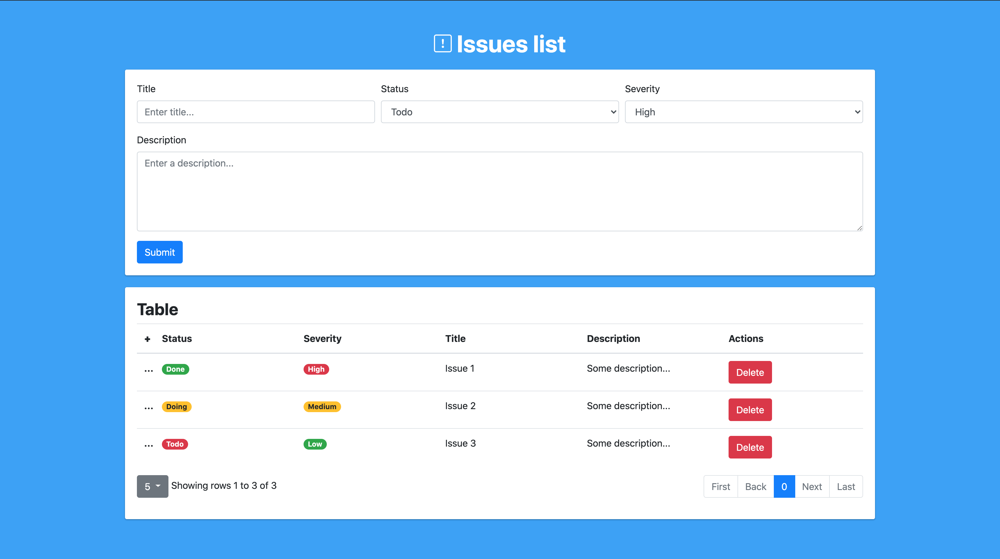

# Preference's task
## Description
The aim is to develop an application focused on the visualization of existing issues. 

## Final result

## Specifications
Each issue will be structured by: 
- Title 
- Description
- Severity (High, medium, low) 
- Status (TODO, DOING, DONE)

The issue status must be editable from the issue list itself, not from any detailed view. We recommend all fields editable in the issue list itself.

Don't use save button, just autosave.

Use websocket to update issues automaticaly when something changes.

Asume users will use last chrome version (don't care about browser compatibilities)

Use the backend technology you want, for frontend you must use VueJS or React, and we recommend also to use typescript

You can use the DB technology you want.

## Technologies
- **Front-end**
  - [**React**](https://es.reactjs.org/). A JavaScript library for building user interfaces
  - [**React-Bootstrap**](https://react-bootstrap.github.io/). React-Bootstrap replaces the Bootstrap JavaScript. Each component has been built from scratch as a true React component, without unneeded dependencies like jQuery.
  - [**React-Bootstrap-Table2**](https://react-bootstrap-table.github.io/react-bootstrap-table2/). React-Bootstrap-Table2 allow us to implement some complex components to manage a table like pagination, search box, etc.
  - [**Client Socket.io**](https://www.npmjs.com/package/socket.io). SocketIO enables real-time bidirectional event-based communication.
- **Back-end**
  - [**NodeJS**](https://nodejs.org/en/). As an asynchronous event-driven JavaScript runtime, Node.js is designed to build scalable network applications.
  - [**Express**](https://www.npmjs.com/package/express). 
  - [**Server Socket.io**](https://www.npmjs.com/package/socket.io). SocketIO enables real-time bidirectional event-based communication.
  - [**Nodemon**](https://www.npmjs.com/package/nodemon). Nodemon is a tool that helps develop node.js based applications by automatically restarting the node application when file changes in the directory are detected.
- **Database**
  - [**MongoDB**](https://www.mongodb.com/).

## Installation and deployment
First of all, you must have installed NPM package manager.

Now, you have to open two terminals and install the project dependencies (it may take a while):
  - In the client folder: `npm i`
  - In the server folder: `npm i`

After that, execute the following commands:
  - In the server folder: `npm start`. First the server because is inserting some data into the database! 
  - In the client folder: `npm start`
  
The database is located in an online server, so there's no need to install it locally.
